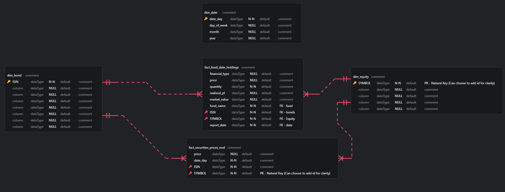
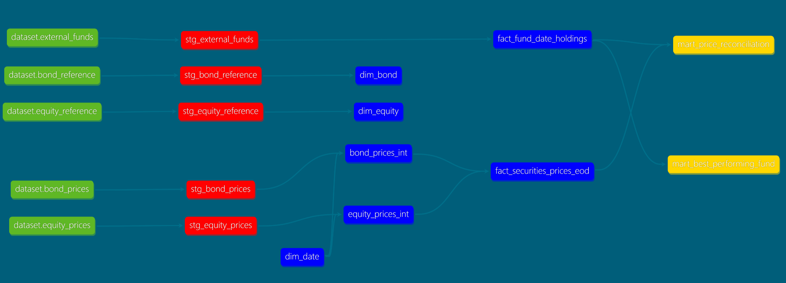

## Solution

1. Code up a solution that could potentially be deployed, and describe the gaps/dependencies you will need work on to achieve a production version.

### Solution 1

A solution is developed using `dbt` to transform the marts as necessary. A postgres database is used to prototype the solution.

Raw data is first loaded into a `raw` schema in the database. A sample python script (`myloader.py`) is provided 

Consecutive transformations follow the medallion architecture.
- Staging tables : Red
- Core tables (Facts/Dimensions): Blue
- Data Marts : Gold

Facts and Dimensions are designed following a `star schema`.

Next Steps include:
- Ingestion
	- A standardized schedule and orchestrator should be defined to collect the data into a data lake. Existing data is loaded using a SQL script and loose csv files. 
	- An OLAP database (such as snowflake) is preferred in order to serve high analytics with a high read frequency.
- Deployment of the ETL pipeline
	- The ETL pipeline consists of a dbt project with reference to the above ERD. A scheduler is needed to deploy the solution. 
	- As dbt was the chosen approach, it is possible to orchestrate using and container/serverless service that is able to run python.
- Data Visualization and Delivery
	- Visualization and data consumption can be performed using any dashboarding tool which can connect to the OLAP database. (eg Apache Superset/ Tableau)

---

### Solution 2

Data Visibility is highly attainable using dbt. Some sample unit tests for Primary Keys are included in the core tables.

---

### Solution 3

Price reconciliation report is generated as a data mart (`mart_price_reconciliation`) in the OLAP Database. A sample of the report is provided in the csv file:
`price_reconciliation_report.csv`

Scalability is not an immediate concern due to the nature of the report being generated as a database table. Query optimization can be performed as necessary when the reporting marts get too large.

---

### Solution 4

Best Performing funds is generated as a data mart (`mart_best_performing_fund`) in the OLAP Database. A sample of the report is provided in the csv file:
`best_performing_fund.csv`

The logic to generate the best performing fund is computed by 
1. aggregating the fund's equity holdings and realised P/L for the report
1. Comparing against last known reported equity total value
1. Comparing against first known reported equity total value (For cumulative change)
1. creating a dense rank comparison on percent_change and cumulative_percent_change.

---

